📌Laporan Praktikum 1 Sistem Operasi

Nama : M. Rizky Taufik Nur Hidayat

NIM  : 09030582327076

Kelas: TK4B

<h1 style="font-weight: bold;">
  Laporan-Praktikum-2-Sistem-Operasi-Cara-Install-Linux-Ubuntu
</h1 >

<ol>
<li>Download Virtual Machine VirtualBox sebagai machine virtual untuk menambah sistem operasi</li>
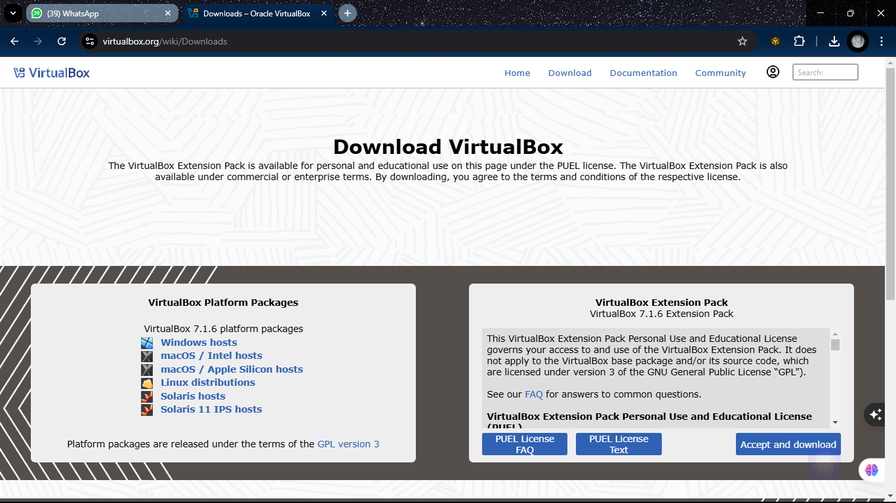
<li>Download sistem operasi Linux Ubuntu sebagai sistem operasi</li>
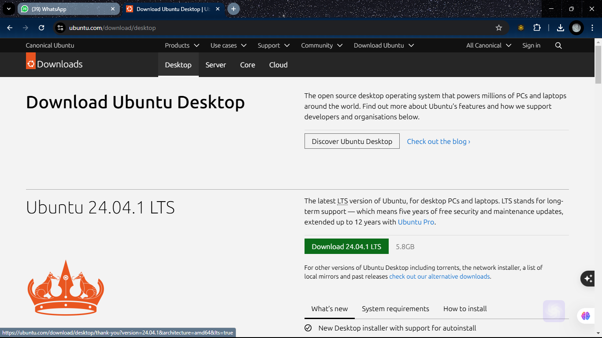
<li>Installasi VM Virtual Box</li>
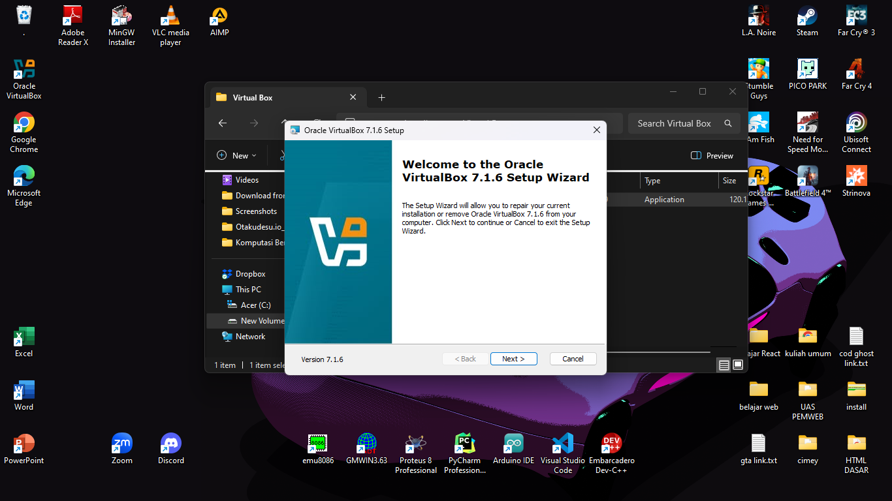
<li>Open Virtual Box lalu pilih New untuk membuat sistem operasi virtual</li>
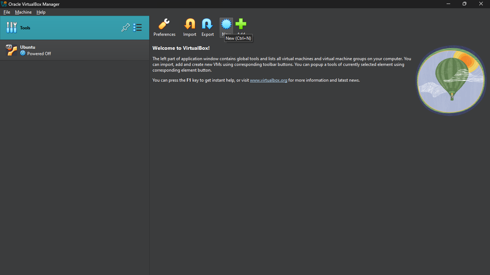
<li>Masukkan nama folder, path folder, dan ISO dari Linux Ubuntu yang telah di install</li>
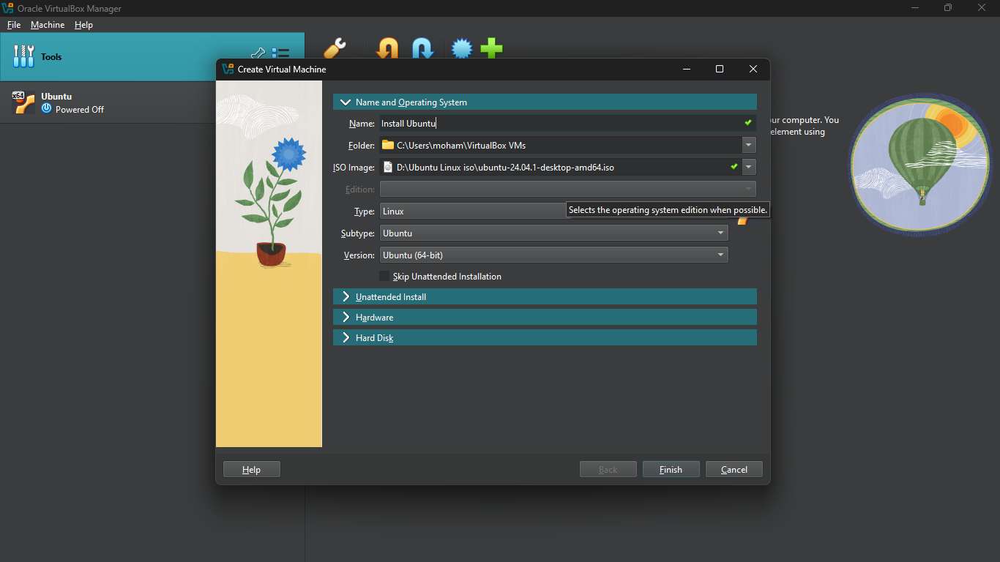
<li>Ganti Nama Pengguna, dan password (Optional)</li>
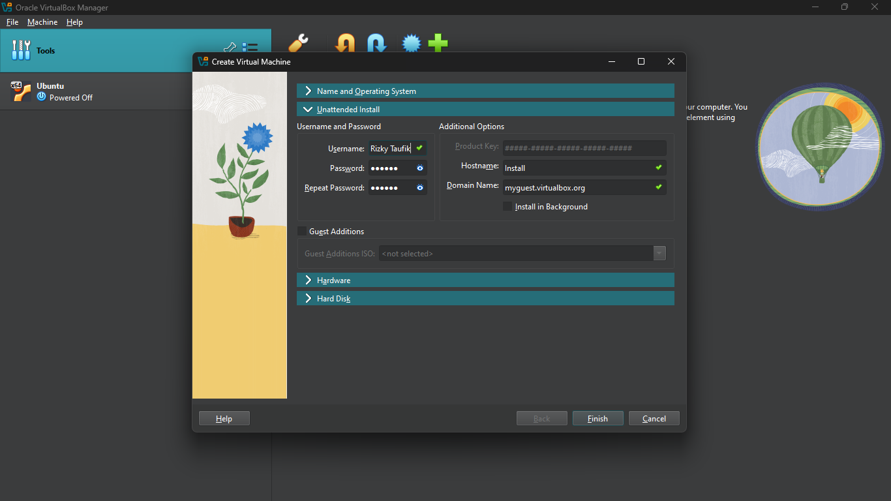
<li>Sesuaikan RAM yang akan dipakai Sistem Operasi serta jumlah prosesornya</li>
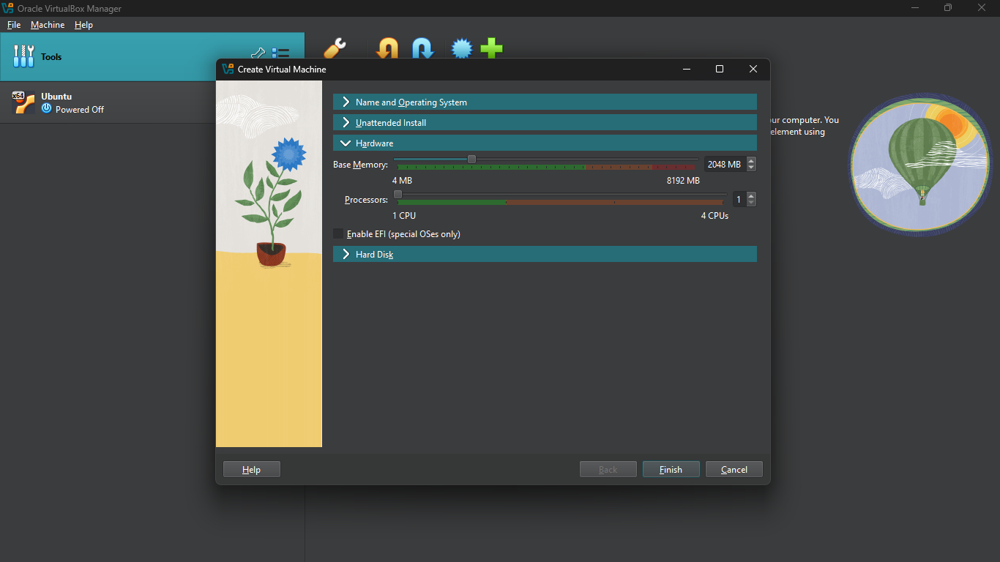
<li>Sesuaikan Penyimpanan dari Linux yang akan di pakai, minimal 25 GB. 
Lalu klik Finish jika sudah selesai konfigurasinya</li>
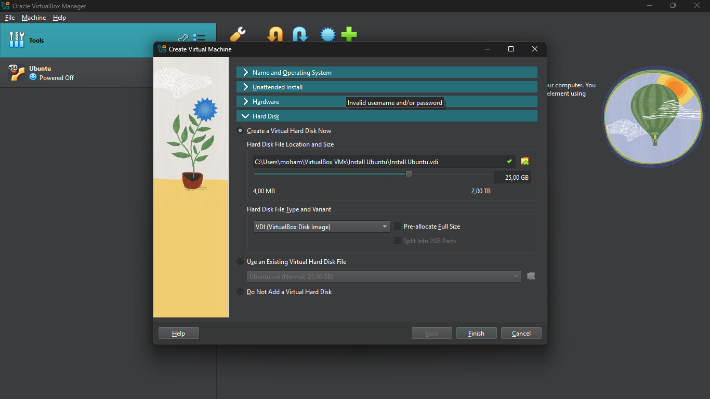
<li>Klik Start untuk menjalankan Sistem Operasinya</li>
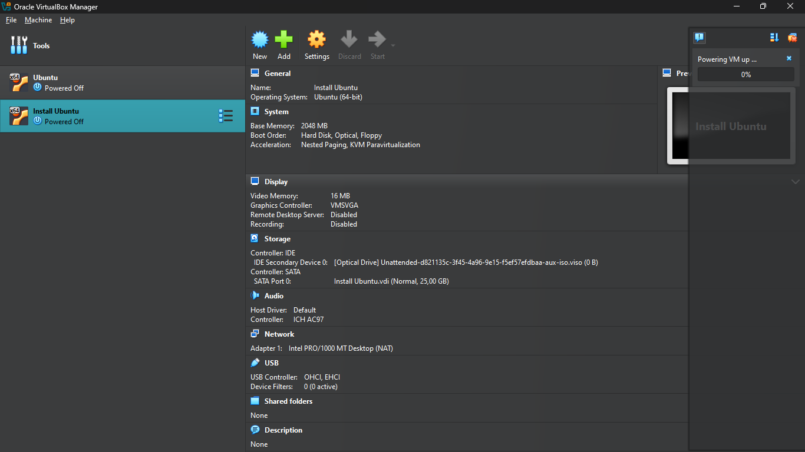
<li>Tunggu sampai set-up nya selesai</li>
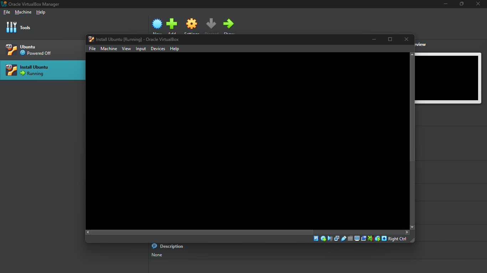
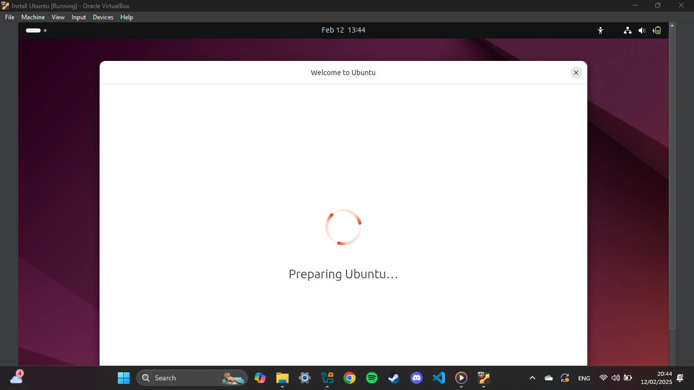
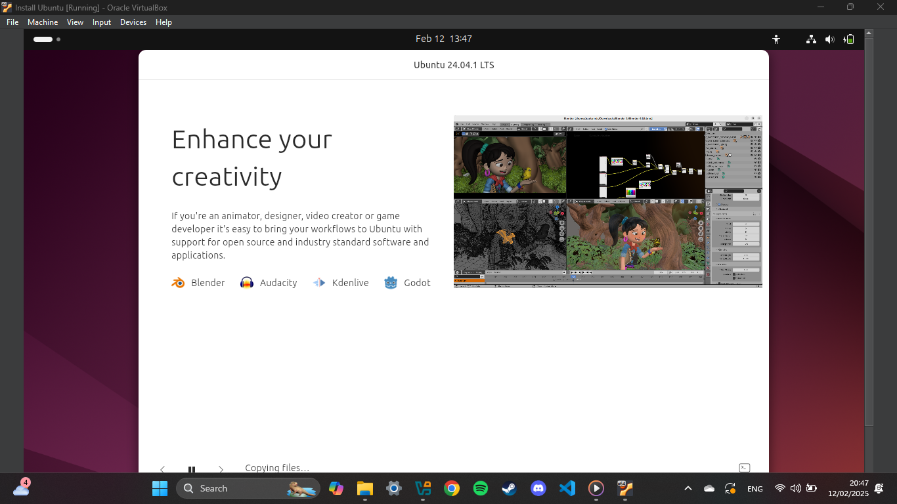
<li>Jika sudah ada menu di side bar kiri,maka Sistem Operasi Linux Ubuntu siap digunakan</li>
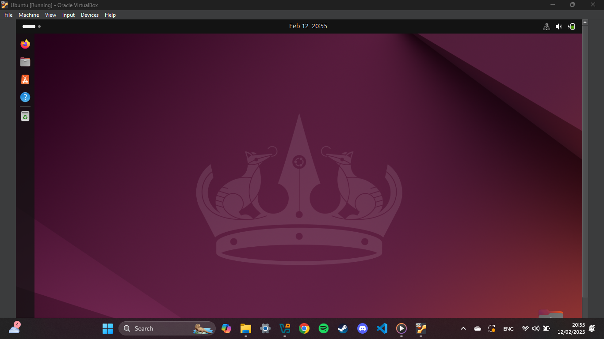
  
</ol>
